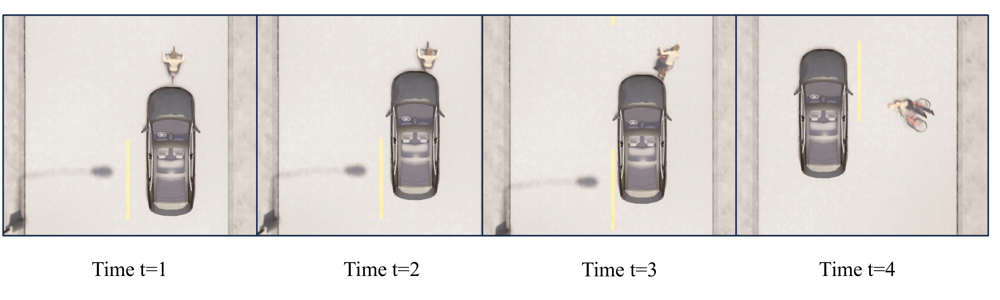

<!-- 
{% include note.html content="If you're cloning this theme, you're probably writing documentation of some kind. I have a blog on technical writing here called <a alt='technical writing blog' href='http://idratherbewriting.com'>I'd Rather Be Writing</a>. If you'd like to stay updated with the latest trends, best practices, and other methods for writing documentation, consider <a href='https://tinyletter.com/tomjoht'>subscribing</a>. I also have a site on <a href='http://idratherbewriting.com/learnapidoc'>writing API documentation</a>." %}
 -->


<h2 style="font-size: 30px;font-weight: bold">1. Introduction</h2>
<span style="font-size: 18px;">
With the rise of autonomous vehicles, ensuring the reliability of autonomous driving systems (ADSs) is crucial. Driving simulators are vital for testing ADSs, offering realistic and configurable environments. However, many ADS testers overlook simulator reliability, risking safety in real-world deployment. Our research found that simulators sometimes fail to report certain collisions, termed *ignored collision scenarios*.
We introduce ICSFuzz, a black-box fuzzing approach to systematically discover ignored collision scenarios and enhance simulator reliability. ICSFuzz starts with known collision scenarios and, guided by empirical collision factors, selectively mutates them to uncover ignored collisions.
Comparing ICSFuzz with DriveFuzz, a leading ADS testing method, ICSFuzz outperformed DriveFuzz, discovering 10–20 times more ignored collision scenarios with a 20–70 times speedup. Seven types of ignored collisions were missed by DriveFuzz. All discovered ignored collisions were confirmed by developers, with one assigned a CVE ID.

</span>


<h2 style="font-size: 30px;font-weight: bold">2. Bug Discovery</h2>
<span style="font-size: 18px;">
We have identified 10 different types of ICSs, each exhibiting unique conditions and outcomes. The developer acknowledged the bug and claimed a partial fix. Additionally, the bug was assigned a CVE ID, which will be updated after the paper review.
</span>


<span style="font-size: 18px;">
In Section 2.1, we provided links to the issues reported to the developer, along with scene description videos. This section serve as a supplement to Table 2 in the paper.
In Section 2.2, we analyze several bugs in detail and discuss the possible severe consequences.
</span>

<span style="font-size: 18px;">
<h2 style="font-size: 25px;font-weight: bold">2.1 Discovered ICSs</h2>
<span style="font-size: 18px;">
</span>

|  #No.   | Scenario| Description | Bug Report | Video|
|  ----  | ----  | ----| --| --|
| ICS 01  |Follow Leading Bicycle | The left corner of vehicle collide with the bicycle, the motion state of bicycle significantly changed.| [issues01](https://github.com/carla-simulator/carla/issues/7025)| [Video](https://youtu.be/90UjwbenwmQ)
| ICS 02  | Follow Leading Bicycle | The head center of the vehicle hit the bicycle, sending it flying. | [issues02](https://github.com/carla-simulator/carla/issues/7025)|[Video](https://youtu.be/UP5NdyNeXls)
| ICS 03  | Follow Leading Vehicle | The left front corner of the rear vehicle hit the right rear corner of the front vehicle. | [issues03](https://github.com/carla-simulator/carla/issues/7025)|[Video](https://youtu.be/aSOXJVpqIEg)
| ICS 04  | Lane Change| The left front corner of the rear vehicle hit the right rear corner of the front vehicle. | [issues04](https://github.com/carla-simulator/carla/issues/7025)|[Video](https://youtu.be/SLZ7hAyEQ70)
| ICS 05  | Lane Change| The head of the rear vehicle scrape with the rear bumper of the front vehicle. | [issues05](https://github.com/carla-simulator/carla/issues/7025)|[Video](https://youtu.be/DfkYDoVsYQM)
| ICS 06  | Intersection Collision | The rear end of one vehicle scraped vertically against the left front corner of another vehicle's front end. | [issues06](https://github.com/carla-simulator/carla/issues/7025)|[Video](https://youtu.be/Pw8WLTboDt8)
| ICS 07  | Intersection Collision| The body of one vehicle scraped vertically against the front end of another vehicle as it passed by. | [issues07](https://github.com/carla-simulator/carla/issues/7025)|[Video](https://youtu.be/ClFrdoWaYvw)
| ICS 08  | Pedestrian Standing Front| The body of the vehicle grazed against the pedestrian as it drove by, knocking the pedestrian down. | [issues08](https://github.com/carla-simulator/carla/issues/7025)|[Video](https://youtu.be/sk1ajuxKcxI) 
| ICS 09  | Pedestrian Standing Front| The front bumper scraped the vehicle down. | [issues09](https://github.com/carla-simulator/carla/issues/7025)|[Video](https://youtu.be/3tkwENfjc_s)
| ICS 10  | Pedestrian Crossing Front| The rear of the vehicle knocked down the pedestrian who was in motion. | [issues10](https://github.com/carla-simulator/carla/issues/7025)|[Video](https://youtu.be/m1ujUC1OudI)


<!-- <br> -->

<!-- <h2 style="font-size: 30px;">Case Study</h2> -->
<h2 style="font-size: 25px;font-weight: bold">2.2 Case Study</h2>



<span style="font-size: 18px;">
**ICS 01:**
As shown in the Figure above, a clear collision occurred from *t2*, and the NPC bicycle was knocked down by the vehicle at *t3*. After the EV departs, the NPC bicycle falls to the ground (*t4*), resulting in significant damage. 
Notably, the collision detector failed to report the incident throughout the entire sequence.
</span>

<span style="font-size: 18px;">
**Safety Consequences:**
If an ADS encounters this collision scenario during testing or development in the simulator, it may prevent the ADS developers from identifying and making necessary improvements to the system. Consequently, when the same ADS is deployed in the real world and encounters similar environmental conditions, it could make the same erroneous decision, potentially leading to a real collision with a cyclist. 
Such incidents could result in severe injuries or even fatalities for the cyclist.
</span>

<span style="font-size: 18px;">
The potential consequences underscore the critical need for robust collision detection mechanisms in the simulator to ensure the safety and reliability of ADS during testing and development, ultimately safeguarding real-world applications.
</span>


<br>
<br>
<br>
<h2 style="font-size: 30px;font-weight: bold">3. Bug Analysis</h2>
<h2 style="font-size: 25px;font-weight: bold">3.1 Single Factor Analysis of Bug Causation</h2>
<span style="font-size: 18px;">
By examining the relationship between the final results, the selected control factors, and the search directions, we aim to uncover the correlation between specific control parameter values and the occurrence of ICSs.
</span>

<span style="font-size: 18px;">
In Section 3.1, we investigate how individual factors contribute to ICS occurrences, serving as a supplement to RQ2 in the paper. In Section 3.2, we explore the combined effect of multiple control factors on ICS occurrences.
</span>


<h2 style="font-size: 20px;font-weight: bold"><em>3.1.1 Collision Distance</em></h2>

<!--  -->

<div style="text-align: center;">
  
  <p><b>Figure 1:</b> Correlation Between ICS Success Rate and Collision Distance</p>
</div>

<span style="font-size: 18px;">
Overall, the data trend in the final result indicates that the effective search direction for ICS searching of collision distance is towards increasing distance in all scenarios except for PCF, where the direction decreases distance. In scenario FLB, FLV, LC and PSF, there is a significant positive correlation between ICS SR and collision distance. Similarly, in scenario InC, the overall SR trend remains, with a slight fluctuation in the middle distance range. In scenario PCF, the overall ICS SR exhibits a declining trend as the distance increases. The reason for the negative correlation in scenario PCF is that the NPC pedestrian is walking in the direction perpendicular to the driving direction of the EV. As the collision distance increases, the probability of the NPC pedestrian moving out of the collision area also increases. 
</span>


<span style="font-size: 18px;">
The overall upward trend aligns with our search direction, and the significant difference in SR observed during the transition from low speed to medium/high speed demonstrates the effectiveness of our search step size. Moreover, the data trend contradicts the intuition regarding the relationship between collision distances and real collisions. Intuitively, one would expect a higher occurrence of collisions when two vehicles are close to each other and one of them changes the driving behavior, suggesting that more ICSs should occur within a close distance. However, the results reveal that more ICSs are found when the distance between two vehicles is far, with one of them altering their driving behavior.
</span>


<h2 style="font-size: 20px;font-weight: bold"><em>3.1.1 Collision Speed</em></h2>

<!--  -->

<div style="text-align: center;">
  
  <p><b>Figure 2:</b> Correlation Between ICS Success Rate and Collision Speed</p>
</div>


<span style="font-size: 18px;">
The experimental results indicate that, although the collision speed parameter does not significantly impact the overall outcomes compared to the other two parameters, a positive correlation still exists between the ICS success rates and collision speed in most scenarios. From Figures above, it can be observed that in most scenarios, there exists a positive trend between collision speed and the final ICS SR. Except for FLV, more ICS were discovered while collision speed was at the middle range.
</span>

<span style="font-size: 18px;">
The data illustrates that more ICSs are found when the collision speed is high, which aligns with our search direction and illustrates that our search steps effectively detect ICSs. Our empirical study reveals that, in reality, a higher number of collisions occur at low collision speeds, where one would expect a more significant presence of ICSs. However, contrary to this expectation, our experimental results are in the opposite direction in most scenarios about the collision factor speed, which demonstrates that more ICSs are found when the collision speed is middle and high. The distinction may be because, at high collision speeds, the collision detector lacks sufficient time to react and detect the collision accurately, leading to a higher proportion of ignored collisions.
</span>


<h2 style="font-size: 20px;font-weight: bold"><em>3.1.1 Collision Angle</em></h2>
<!--  -->
<div style="text-align: center;">
  
  <p><b>Figure 3:</b> Correlation Between ICS Success Rate and Collision Angle</p>
</div>

<span style="font-size: 18px;">
The data trends of ICS SR related to angle in different scenarios align with the trend of high on both sides and low in the middle. 
The fluctuations in the data result from some specific environmental settings.
</span>

<span style="font-size: 18px;">
Overall, for collision angle values greater than 0, a positive correlation between the collision angle and the final ISC SR is observed in almost all scenarios except for scenarios in FLV, indicating its effectiveness in detecting ICS.
The data trend of scenarios in FLV with the positive angle range exhibits fluctuations. 
One reason is that many scenarios close to ICS are happened when the angle is near 0.
</span>

<span style="font-size: 18px;">
For collision angle values smaller than 0, the ICS SR trends of most scenarios also match our conclusion derived from the study, except for PSF and FLV. For scenario PSF, it does not have ICS when the collision angle is negative since the pedestrian is standing in the right front of the EV. In scenario FLV, the peak observed in the negative angle range can also be attributed to a higher number of occurrences of type 3 ICS within the specific angle range. The decreasing trend observed as the collision angle approaches -1 is due to the scenarios being at the border between collision and non-collision, leading to a decrease in both the number of collisions and the corresponding number of ICSs.
</span>


<span style="font-size: 18px;">
The search direction for collision angle is from -1 or 1 to 0 (-90&deg; or 90&deg; to 0&deg; in Figure related to control parameters in the paper). The steep slope of the data trend demonstrates the effectiveness of the search direction and search steps obtained from our study. However, the collision frequency trend in reality is the opposite; there are more collisions when the collision angle is close to 0, given that the "Vehicle State While Colliding" has the highest proportion of vehicles moving straight ahead. The reason for such counter-intuition distinction is that collision angles near 0 often result in a stronger collision force, making them less likely to be missed by the collision detector. 
Conversely, collision angles approaching 1 and -1 (-90&deg; and 90&deg;) encompass a broader range of collision and non-collision scenarios, leading to more identified ICSs.
</span>


<h2 style="font-size: 25px;font-weight: bold">3.2 Multiple Factor Analysis of Bug Causation</h2>

<!--  -->

<div style="text-align: center;">
  
  <p><b>Figure 4:</b> Correlation Between ICS Success Rate and Collision Speed Across Different Distance Scopes</p>
</div>

<span style="font-size: 18px;">
**3.2.1 Impact of Collision Distance on Search Direction for Collision Speed**

<span style="font-size: 18px;">
<!-- % no, collision speed still doesn't have a large impact compared with collision distance -->
From Figure of relationship between ICS SR and collision distance at different collision speed scope, when examining three specific collision distance groups, the trend for three different collision speed groups remains relatively consistent compared to not considering the collision distance.


<!-- Relationship between ICS SR and Collision Distance at Different Collision Speed Scope. -->

<!--  -->
<div style="text-align: center;">
  
  <p><b>Figure 5:</b> 
 Correlation between ICS SR and Collision Speed at Different Collision Distance Scope. 
</p>
</div>


<span style="font-size: 18px;">
**3.2.2 Impact of Collision Speed Scope on Search Direction for Collision Distance**

<span style="font-size: 18px;">
Figure of relationship between ICS SR and collision speed at different collision distance scope shows the trends in the SR across different collision distances for three collision speed scopes.
The observed patterns strongly support the conclusion made above regarding the impact of collision distance as a single feature.
In most scenarios, a high collision speed consistently results in more ICSs when combined with a far collision distance.
Except for PCF, a combination of close collision distance and high collision speed leads to more identified ICSs. 
</span>


<!--  -->
<div style="text-align: center;">
  
  <p><b>Figure 6:</b> 
  Relationship between ICS SR and Collision Angle at Different Collision Speed Scope.
</p>
</div>

<span style="font-size: 18px;">
**3.2.3 Impact of Collision Speed Scope on Search Direction for Collision Angle**

<span style="font-size: 18px;">
The relationship between ICS occurrences and the collision angle, as depicted in Figure of relationship between ICS SR and collision angle at different collision speed scope, remains largely unchanged across different collision speed conditions compared to the trend without considering the effect of collision speed.
The effective search directions for the collision angle remain consistent across different speed scopes, similar to when considering the collision angle independently. 
In scenario InC, a distinct data trend difference at low collision speed is observed at positive collision angles.
However, since the pattern is not observed in other scenarios, it is likely attributed to data noise.
</span>

<!--  -->

<div style="text-align: center;">
  
  <p><b>Figure 7:</b> 
  Relationship between ICS SR and Collision Angle at Different Distance.
</p>
</div>


<span style="font-size: 18px;">
**3.2.4 Impact of Collision Distance Scope on Search Direction for Collision Angle**

<span style="font-size: 18px;">
When considering the variations of collision angle across different collision distances, the observed data trend differs slightly from considering collision angle alone. In scenarios LC, PSF, and InC, the data aligns with the trend of increasing collision angle, bringing more ICSs. Similarly, although there are fewer fluctuations in the middle collision distance scope in scenario FLV, the overall trend still holds. Moreover, the SR exhibits a higher slope at greater collision distances, indicating that simultaneously increasing both collision distance and collision angle can lead to more ICSs.

<span style="font-size: 18px;">
In scenario FLB, the relationship between collision angle and final SR is unstable and exhibits significant fluctuations under far collision distances. For collision in middle and far distances, the trend similar to the total trend in general. But the middle collision distance brings more ICS. When considering the collision distance and collision angle together, the middle collision distance and the collision angle close to -1 and 1 create more ICSs.

<span style="font-size: 18px;">
In scenario PCF, exceptions also occur at low collision distances. The exception results in different search directions for PCF at different collision distances compared to the one while angle alone in scenario PCF. In the low collision distance scope, there are hardly any ICSs for the positive collision angle. Hence, the search direction should be towards increasing negative collision angles. Conversely, the situation is reversed in the middle and far collision distance scopes. There are few collision incidents when the collision angle is negative, the search direction should be towards increasing to the positive collision angles. The significant occurrence of ICSs in the negative collision angle zone at low collision distances can be attributed to the different relative positions between the EV and the NPC if changed driving behavior at different collision distances. When driving behavior changes at low collision distances, the pedestrian just steps onto the lane, which corresponds to the negative collision angle region. In order to collide with the pedestrians, the vehicle needs to veer towards the negative angle region. On the other hand, at middle to high collision distances, the pedestrian has already reached the region marked by the positive collision angle by the time the EV approaches. Hence, collision events are more likely to occur in this region. Generally, collision scenarios with a moderate collision distance and collision angle close to 1, as well as collision scenarios with a low collision distance and negative collision angle, tend to result in a higher number of identified ICSs.
</span>


<h2 style="font-size: 30px;font-weight: bold">4. Comparison between ICSFuzz and DriveFuzz</h2>


<div style="display: flex; justify-content: center;">
  <table>
    <thead>
      <tr>
        <th><strong>Mutation Mode</strong></th>
        <th><strong>All</strong></th>
        <th><strong>Congestion</strong></th>
        <th><strong>Entropy</strong></th>
        <th><strong>Instability</strong></th>
      </tr>
    </thead>
    <tbody>
      <tr>
        <td><strong>Running times</strong></td>
        <td>779</td>
        <td>884</td>
        <td>1976</td>
        <td>893</td>
      </tr>
      <tr>
        <td><strong>Detected ICS</strong></td>
        <td>12</td>
        <td>10</td>
        <td>22</td>
        <td>0</td>
      </tr>
    </tbody>
  </table>
</div>
<!-- | **Mutation Mode** | **All** | **Congestion** | **Entropy** | **Instability** |
|-------------------|---------|----------------|-------------|-----------------|
| **Running times** | 779     | 884            | 1976        | 893             |
| **Detected ICS**  | 12      | 10             | 22          | 0               | -->

<span style="font-size: 18px;">
In addition to the comparison results provided in the paper, we also tested DriveFuzz running in the different modes they offer and serves as a supplement to RQ1. We ran DriveFuzz in each mode separately for 36 hours. The results are presented in the table above. DriveFuzz can merely detect a few ICSs within the limited runtime regardless of the mode used. DriveFuzz tends to spend more time exploring the non-collision space than exploring further possibilities from the collision space. It also stops immediately after finding an ICS and then initiates a new round of testing using a new seed scenario. 

<span style="font-size: 18px;">
As a result, DriveFuzz not only misses the opportunity to explore the IC scenario space but also spends more time restarting from a new position in the non-collision scenario space, which is unrelated to the previous round. Also, the ICSs identified by DriveFuzz, after investing a significant amount of time, exhibit a notable repetition, which further highlights the inefficiency of its search strategy. Comparatively, our incremental search strategy that commences from the collision scenario space has exhibited a discernible superiority.


<h2 style="font-size: 30px;font-weight: bold">5. Oracle Threshold</h2>

<div style="text-align: center;">
  
  <p><b>Figure 8:</b> 
  Relationship between Final ICS Results and Different Oracle Threshold Values
</p>
</div>
<!--  -->
<span style="font-size: 18px;">
As we use the object detection bounding box as our oracle for ICS discovery, we aim to investigate whether this oracle is sufficiently reliable and accurate in identifying ICSs.
Therefore, we conducted an ablation study to examine the relationship between threshold and performance and investigate the impact of the IoU threshold on the final ICS results.
Three representative scenarios, FLB, LC, and PSF, are tested, each involving different struck objects.
We explore whether different NPC types affect the TP proportion when the IoU threshold changes.
 
<span style="font-size: 18px;">
For scenario FLB, 
We set the collision distance to 3 and the collision speed to 2. The collision angle on the x-axis was fixed at 0.02, while the collision angle on the y-axis varied from 0 to 1 in increments of 0.02. 
Similarly, for scenario LC, we set the collision distance to 5 and the collision speed to 30. The collision angle on the y-axis was fixed at 0.02, and the collision angle on the y-axis ranged from 0 to 1 with a step of 0.02. 
For scenario PSF, we set the collision distance to 2 and the collision speed to 4. The collision angle on the x-axis was fixed at 0, and the collision angle on the y-axis ranged from 0 to 1 with a step of 0.02. 
Each scenario will be run 50 times under the specification above.
The final results have been manually confirmed and presented in Figure above.

<span style="font-size: 18px;">
The final precision, recall, and the number of true positives are shown in Figure above.
For scenario FLB, involving a bicycle as the NPC, the precision remains relatively consistent for thresholds ranging from 0 to 0.15. However, the recall decreases as the threshold increases, with a significant drop beyond 0.15. The optimal threshold value for FLB is still 0. 
Similarly, for scenario LC with a vehicle as the NPC, the precision is high at thresholds of 0 and 0.2. However,  there is only 1 TP when the threshold is 0.2, the number of true positives exhibits a decreasing trend, and an IoU threshold of 0 yields the best results. In scenario PSF with a pedestrian as the NPC, raising the threshold above 0.05 did not result in additional ICSs. Therefore, setting the threshold at 0 is still the most reasonable choice for our ICS discovery method.

<span style="font-size: 18px;">
**Summary:** Despite the potential false positives in the threshold set for our oracle, ICSFuzz remains highly effective in detecting ICSs according to our empirical evidence.
Additionally, the false positive results may include IC-prone scenarios that hold practical significance, introducing new threats for ADS in real-world scenarios.


<!-- 
### Baseline Comparison


(a) Comparison of time taken to identify ICSs, logarithmically scaled.
    (b) Comparison of time and proportion ratio for three types of ICSs identified by DriveFuzz. -->

<!-- ### DriveFuzz Comparison in different modes -->


<br>
<br>
<br>
<br>
<br>


<h2 style="font-size: 30px;font-weight: bold">6. Empirical Study</h2>
<h2 style="font-size: 25px;font-weight: bold">6.1 Collision-Contributing Factors</h2>
<!-- ### Collision-Contributing Factors -->
<!-- insert the studied tables -->

| **Crash Factors** | **Target** | **Values** |
| ----------------- | ---------- | ---------- |
| **Time**          | AV         | Daylight (43.75%), Dark (56.25%)  |
|                   |            | Daylight (67.3%), Unknown (32.7%)  |
|                   |            | Daylight (64.52%), Dark street lights (33.33%), Dusk-dawn (2.15%)  |
|                   |            | Daylight (45%), Other (43%), Dark night (9%), Dusk-dawn (3%)  |
|                   | Bicycle    | Good daytime lighting (46.4%), Poor daytime lighting (15.4%), Poor lighting at night (28.5%), Poor lighting at night (9.7%)  |
|                   |            | Daylight (52.2%), Dark (30.1%), Dusk or Dawn (17.8%)  |
|                   |            | Daytime (77.2%), Nighttime w/ Lighting (18.3%), Nighttime wo/ Lighting (4.5%)  |
| **Collision Type**| AV         | Rear-end: (59.38%), Other (40.63%)  |
|                   |            | Front (25.7%), Left (25.1%), Rear (21.2%), Right (21%), Top (4.5%), Bottom (2.4%)  |
|                   |            | Rear-end (64%), Sideswipe (15%), Broadside (12%), Head-on (12%)  |
|                   |            | Rear-end (61.1%), Sideswipe (24.8%), Other (6.2%), Broadside (5.3%), Head-on (2.7%)  |
|                   |            | Rear-end (49.85%), Sideswipe (20.64%), Head-on (10.86%), Broadside (6.57%), Bike/Pedestrian (6.7%), Hit object (5.81%)  |
|                   |            | Other (45%), Rear-end (38%), Sideswipe (11%), Head-on (3%), Hit-object (3%)  |
|                   | Pedestrian | Frontal impact (43.8%), Side impact (24.1%), Car moving forward (23.2%), Back (6.2%), No impact (3.6%)  |
|                   | Bicycle    | For bicycle: Side (54.7%), Frontal (19.9%), Scrape (14.2%), Rear-end (8.2%), Others (3%), For vehicle: Left hood (24.3%), Frontal hood (17.6%), Right hood (26.7%), Left back (4.1%), Back (3%), Right back (2.6%), Left body (9.7%), Right body (12%)  |
|                   |            | Front (64.4%), Right (19.4%), Left (10.6%), Rear (5.6%)  |
| **Speed**         | AV         | ≤25mph (88.54%), >25mph (21.88%)  |
|                   |            | [0,15] (31.8%), [15,30] (17.3%), [30,45] (16.2%), [45,60] (16.2%), [60,75] (15%), [75,90] (2.9%), [90,105] (0.6%) m/s  |
|                   | Pedestrian | 2-10m/s (50.8%), 10-20m/s (42.9%), 20-30m/s (5.9%), >30m/s (0.5%)  |
|                   | Bicycle    | Speeding (33.1%)  |
| **Weather**       | AV         | Clear weather (88.54%), Cloudy (5.21%), Raining (3.13%), Fog/Visibility (2.08%)  |
|                   |            | Clear (77.42%), Cloudy (19.35%), Raining (12.15%), Fog (1.08%)  |
|                   |            | Clear (48%), Other (44%), Cloudy (5%), Raining (2%), Fog (1%)  |
|                   | Bicycle    | Sunny (70.87%), Rain (15.72%), Fog (7.11%), Snow (2.6%), Rain (3.7%)  |
|                   |            | Clear (68.9%), Rain/Snow/Fog (16.7%), Cloudy (14.4%)  |
|                   |            | Visibility fine (82.8%), Visibility reduced (14.9%), Other (2.3%)  |
| **Accident Location** | AV     | Road Type: Intersection (65.63%), Street Width: ≤60 feet (78.13%), Trees: 80.21%  |
|                   |            | Highway/Freeway (32.0%), Unknown (37.6%), Intersection (13.6%), Street (13.4%), Rural road (2.2%), Parking lot (1.3%)  |
|                   |            | Intersection (47.31%), Street (35.48%), Highway (13.98%), Parking lot (3.23%)  |
|                   |            | Intersection (73.5%)  |
|                   |            | Intersections (69.72%), Street (21.71%), Expressway (4.74%)  |
|                   | Bicycle    | Road Type: Straight road (23.9%), Ramp (9.4%), Four-leg intersection (45.6%), Three-leg intersection (21.1%), Single-lane (5.6%), Two-lane two-way (7.8%), Four-lane two-way (24.4%), Six-lane, two-way (62.2%), Road condition: Dry (78.9%), Wet (16.7%), Water (4.4%)  |
|                   |            | Urban (79%), Rural (21%), Road condition: Dry road surface (31%), Slippery (49.6%), Wet (18.9%)  |
| **Vehicle State** | AV         | Straight (87.50%), Turning movement (12.50%)  |
|                   |            | Other (36.63%), Proceeding straight (20.89%), Unknown (19.89%), Left turn (4.95%), Changing lanes (4.41%), Right turn (1.98%), Backing (1.89%)  |
|                   |            | Stopped (36.08%), Proceeding straight (29.9%), Right turn (5.15%), Slowing/Stopping (10.31%), Left turn (4.12%), Changing lanes (4.12%), Parking maneuver (2.06%)  |
|                   |            | Left turn (11.5%), Right turn (21.2%), No turning (66.3%)  |
|                   |            | Other (44.64%), Stopped (23.21%), Straight (15.18%), Left turn (3.57%), Right turn (2.68%)  |
|                   | Pedestrian | Vehicle moving forwards (99.11%), Parked or reversing (0.89%)  |
| **Collide With**  | AV         | Non-motor vehicles or pedestrians involved (18.75%)  |
|                   | Pedestrian | Car/taxi (90.88%), Motorcycle (3.97%), Bus (5.97%), Light goods vehicle (1.95%), Other (2.09%), Pedal cycle (1.48%), Unknown vehicle (0.06%)  |
| **# of Vehicles** | AV         | 2 (87.50%), 1 (11.46%), 3 (1.04%)  |
|                   |            | 2 (90.3%), 1 (8%), 3 (1.8%)  |
|                   |            | 2 (84.16%), 1 (12.87%)  |


<!-- 

| **Crash Factors** | **Target** | **Values** |
| ----------------- | ---------- | ---------- |
| **Time**          | AV         | Daylight (43.75%), Dark (56.25%) [\cite{divergent_effect}] |
|                   |            | Daylight (67.3%), Unknown (32.7%) [\cite{avoid}] |
|                   |            | Daylight (64.52%), Dark street lights (33.33%), Dusk-dawn (2.15%) [\cite{analysis_poi}] |
|                   |            | Daylight (45%), Other (43%), Dark night (9%), Dusk-dawn (3%) [\cite{automated_latent}] |
|                   | Bicycle    | Good daytime lighting (46.4%), Poor daytime lighting (15.4%), Poor lighting at night (28.5%), Poor lighting at night (9.7%) [\cite{car-bicycle_analysis}] |
|                   |            | Daylight (52.2%), Dark (30.1%), Dusk or Dawn (17.8%) [\cite{single_bicycle_crash}] |
|                   |            | Daytime (77.2%), Nighttime w/ Lighting (18.3%), Nighttime wo/ Lighting (4.5%) [\cite{identifying_factors}] |
| **Collision Type**| AV         | Rear-end: (59.38%), Other (40.63%) [\cite{divergent_effect}] |
|                   |            | Front (25.7%), Left (25.1%), Rear (21.2%), Right (21%), Top (4.5%), Bottom (2.4%) [\cite{avoid}] |
|                   |            | Rear-end (64%), Sideswipe (15%), Broadside (12%), Head-on (12%) [\cite{analysis_poi}] |
|                   |            | Rear-end (61.1%), Sideswipe (24.8%), Other (6.2%), Broadside (5.3%), Head-on (2.7%) [\cite{exploratory_cal}] |
|                   |            | Rear-end (49.85%), Sideswipe (20.64%), Head-on (10.86%), Broadside (6.57%), Bike/Pedestrian (6.7%), Hit object (5.81%) [\cite{learn_crash}] |
|                   |            | Other (45%), Rear-end (38%), Sideswipe (11%), Head-on (3%), Hit-object (3%) [\cite{automated_latent}] |
|                   | Pedestrian | Frontal impact (43.8%), Side impact (24.1%), Car moving forward (23.2%), Back (6.2%), No impact (3.6%) [\cite{typical_pedestrian}] |
|                   | Bicycle    | For bicycle: Side (54.7%), Frontal (19.9%), Scrape (14.2%), Rear-end (8.2%), Others (3%), For vehicle: Left hood (24.3%), Frontal hood (17.6%), Right hood (26.7%), Left back (4.1%), Back (3%), Right back (2.6%), Left body (9.7%), Right body (12%) [\cite{car-bicycle_analysis}] |
|                   |            | Front (64.4%), Right (19.4%), Left (10.6%), Rear (5.6%) [\cite{identifying_factors}] |
| **Speed**         | AV         | ≤25mph (88.54%), >25mph (21.88%) [\cite{divergent_effect}] |
|                   |            | [0,15] (31.8%), [15,30] (17.3%), [30,45] (16.2%), [45,60] (16.2%), [60,75] (15%), [75,90] (2.9%), [90,105] (0.6%) m/s [\cite{avoid}] |
|                   | Pedestrian | 2-10m/s (50.8%), 10-20m/s (42.9%), 20-30m/s (5.9%), >30m/s (0.5%) [\cite{pedestrian_causation}] |
|                   | Bicycle    | Speeding (33.1%) [\cite{car-bicycle_analysis}] |
| **Weather**       | AV         | Clear weather (88.54%), Cloudy (5.21%), Raining (3.13%), Fog/Visibility (2.08%) [\cite{divergent_effect}] |
|                   |            | Clear (77.42%), Cloudy (19.35%), Raining (12.15%), Fog (1.08%) [\cite{analysis_poi}] |
|                   |            | Clear (48%), Other (44%), Cloudy (5%), Raining (2%), Fog (1%) [\cite{automated_latent}] |
|                   | Bicycle    | Sunny (70.87%), Rain (15.72%), Fog (7.11%), Snow (2.6%), Rain (3.7%) [\cite{car-bicycle_analysis}] |
|                   |            | Clear (68.9%), Rain/Snow/Fog (16.7%), Cloudy (14.4%) [\cite{identifying_factors}] |
|                   |            | Visibility fine (82.8%), Visibility reduced (14.9%), Other (2.3%) [\cite{single_bicycle_crash}] |
| **Accident Location** | AV     | Road Type: Intersection (65.63%), Street Width: ≤60 feet (78.13%), Trees: 80.21% [\cite{divergent_effect}] |
|                   |            | Highway/Freeway (32.0%), Unknown (37.6%), Intersection (13.6%), Street (13.4%), Rural road (2.2%), Parking lot (1.3%) [\cite{avoid}] |
|                   |            | Intersection (47.31%), Street (35.48%), Highway (13.98%), Parking lot (3.23%) [\cite{analysis_poi}] |
|                   |            | Intersection (73.5%) [\cite{exploratory_cal}] |
|                   |            | Intersections (69.72%), Street (21.71%), Expressway (4.74%) [\cite{learn_crash}] |
|                   | Bicycle    | Road Type: Straight road (23.9%), Ramp (9.4%), Four-leg intersection (45.6%), Three-leg intersection (21.1%), Single-lane (5.6%), Two-lane two-way (7.8%), Four-lane two-way (24.4%), Six-lane, two-way (62.2%), Road condition: Dry (78.9%), Wet (16.7%), Water (4.4%) [\cite{identifying_factors}] |
|                   |            | Urban (79%), Rural (21%), Road condition: Dry road surface (31%), Slippery (49.6%), Wet (18.9%) [\cite{single_bicycle_crash}] |
| **Vehicle State** | AV         | Straight (87.50%), Turning movement (12.50%) [\cite{divergent_effect}] |
|                   |            | Other (36.63%), Proceeding straight (20.89%), Unknown (19.89%), Left turn (4.95%), Changing lanes (4.41%), Right turn (1.98%), Backing (1.89%) [\cite{avoid}] |
|                   |            | Stopped (36.08%), Proceeding straight (29.9%), Right turn (5.15%), Slowing/Stopping (10.31%), Left turn (4.12%), Changing lanes (4.12%), Parking maneuver (2.06%) [\cite{analysis_poi}] |
|                   |            | Left turn (11.5%), Right turn (21.2%), No turning (66.3%) [\cite{exploratory_cal}] |
|                   |            | Other (44.64%), Stopped (23.21%), Straight (15.18%), Left turn (3.57%), Right turn (2.68%) [\cite{automated_latent}] |
|                   | Pedestrian | Vehicle moving forwards (99.11%), Parked or reversing (0.89%) [\cite{typical_pedestrian}] |
| **Collide With**  | AV         | Non-motor vehicles or pedestrians involved (18.75%) [\cite{divergent_effect}] |
|                   | Pedestrian | Car/taxi (90.88%), Motorcycle (3.97%), Bus (5.97%), Light goods vehicle (1.95%), Other (2.09%), Pedal cycle (1.48%), Unknown vehicle (0.06%) [\cite{typical_pedestrian}] |
| **# of Vehicles** | AV         | 2 (87.50%), 1 (11.46%), 3 (1.04%) [\cite{divergent_effect}] |
|                   |            | 2 (90.3%), 1 (8%), 3 (1.8%) [\cite{exploratory_cal}] |
|                   |            | 2 (84.16%), 1 (12.87%) -->


<h2 style="font-size: 25px;font-weight: bold">6.2 Experiment Results of Unrelated Factors</h2>


<!--  -->

<div style="text-align: center;">
  
  <p><b>Figure 9:</b> 
 Correlation between ICS Proportion and Different Values of Unrelated Collision-Contributing Factors. 
</p>
</div>

<span style="font-size: 18px;">
"'Actor Location', 'Time', and 'Weather' are three factors that were not selected for the ICS discovery. The experimental results indicate that these factors did not contribute to the ICS discovery results."

<h2 style="font-size: 25px;font-weight: bold">6.3 Step Sizes of Control Parameters</h2>

<!--  -->

<div style="text-align: center;">
  
  <p><b>Figure 10:</b> 
 Correlation between ICS results and Different Step Sizes for Different Control Parameters. 
</p>
</div>


<span style="font-size: 18px;">
To determine the suitable search step size for control parameters when generating inputs, we empirically examine the relationship between the number of ICSs and step sizes for each control parameter in different collision scenarios.
We select the most appropriate sizes for collision distance, collision angle and collision speed within each type of collision scenario. 
The different control parameters are run in scenarios FLB, LC, PCS, and InC because they correspond to distinct collision areas of the struck object resulting from variations in environmental settings. 
A larger step size for collision angle may result in missed collisions with bicycles but not with vehicles, due to the larger potential collision area of vehicles. Therefore, a uniform step size cannot be applied across all scenarios, and it is necessary to consider the step size separately for each scenario.

<span style="font-size: 18px;">
During testing, we keep other control parameters fixed while varying the tested parameter within its defined range. We increment or decrement the tested parameter using different step values and count the resulting ICSs. To ensure fairness, we randomly select values for the other control parameters and test the relationship between the final ICS count and the step size over ten rounds, averaging the results. We use the median as the threshold to help determine the exact step value since it can be a more representative metric to guarantee sufficient ICSs with less repetition in the final results. The results are shown in Figure 10. Notably, for collision angles in Carla, which involves a two-dimensional vector with x and y components, we conduct separate tests for each component.

<span style="font-size: 18px;">
For scenario FLB, we observe that when the search step size of the collision angle on the x-axis is smaller than 0.06, the final ICS number is larger or equal to the median. Thus, we select the step size at 0.04 to guarantee sufficient ICSs with less repetition.
The step size for the collision angle on the y-axis is 0.03. For collision distance, we choose the step size of 1 as the steps at 2 and 4 match the median, risks missing ICS. For collision speed, we select the step at 1 since the step sizes larger than 2 only result in 1 ICS or even fewer, which is not ideal for ICS discovery. Using a similar process, we have determined the appropriate step sizes for different parameters in various scenarios. Detailed values are available on our website.


<span style="font-size: 18px;">
Based on a similar process, for scenario LC, we have selected the following step sizes: 0.05 for the angle at x-axis, 0.04 for the angle at y-axis, 1 for the collision distance, and 1 for the speed step. For the scenario PSF, we have selected the following step sizes: 0.03 for the angle at x-axis, 0.03 for the angle at y-axis, 1 for the collision distance, and 1 for the speed step. For the scenario InC, we have selected the following step sizes: 0.05 for the angle at x-axis, 0.02 for the angle at y-axis, 4 for the collision distance, and 1 for the speed step. The step size of collision distance for the scenario InC is because of the scenario specialties. To create the collision at the intersection, the initial distance between the two vehicles is far since they are located at the ends of two vertical roads. If the EV were to change its driving behavior when it is close to NPC, it is highly possible to miss it since they are driving on perpendicular roads. Thus, we select the step size of collision distance to 4 and explore the relationship with the final ICS occurrences.


<!-- 


## Build the Theme

Follow these instructions to build the theme.

### 1. Download the theme

First, download or clone the theme from the [Github repo](https://github.com/tomjoht/documentation-theme-jekyll). Most likely you won't be pulling in updates once you start customizing the theme, so downloading the theme (instead of cloning it) probably makes the most sense. In Github, click the **Clone or download** button, and then click **Download ZIP**.

### 2. Install Jekyll

If you've never installed or run a Jekyll site locally on your computer, follow these instructions to install Jekyll:

* [Install Jekyll on Mac][mydoc_install_jekyll_on_mac]
* [Install Jekyll on Windows][mydoc_install_jekyll_on_windows]

### 3. Install Bundler

In case you haven't installed Bundler, install it:

```
gem install bundler
```

You'll want [Bundler](http://bundler.io/) to make sure all the Ruby gems needed work well with your project. Bundler sorts out dependencies and installs missing gems or matches up gems with the right versions based on gem dependencies.

### 4. Option 1: Build the Theme (*without* the github-pages gem) {#option1}

Use this option if you're not planning to publish your Jekyll site using [Github Pages](https://pages.github.com/).

Bundler's Gemfile specifies how project dependencies are managed. Although this project includes a Gemfile, this theme doesn't have any dependencies beyond core Jekyll. The Gemfile is used to list gems needed for publishing on Github Pages. **If you're not planning to have Github Pages build your Jekyll project, delete these two files from the theme's root directory:**

* Gemfile
* Gemfile.lock

If you've never run Jekyll on your computer (you can check with `jekyll --version`), you may need to install the jekyll gem:

```
gem install jekyll
```

Now run jekyll serve (first change directories (`cd`) to where you downloaded the project):

```
jekyll serve
```

### 4. Option 2: Build the Theme (*with* the github-pages gem) {#option2}

If you *are* in fact publishing on Github Pages, leave the Gemfile and Gemfile.lock files in the theme.The Gemfile tells Jekyll to use the github-pages gem. **However, note that you cannot use the normal `jekyll serve` command with this gem due to dependency conflicts between the latest version of Jekyll and Github Pages** (which are noted [briefly here](https://help.github.com/articles/setting-up-your-github-pages-site-locally-with-jekyll/)).

You need Bundler to resolve these dependency conflicts. Use Bundler to install all the needed Ruby gems:

```
bundle update
```

Then *always* use this command to build Jekyll:

```
bundle exec jekyll serve
```

If you want to shorten this long command, you can put this code in a file such as jekyll.sh (on a Mac) and then simply type `. jekyll.sh` to build Jekyll.

## Running the site in Docker

You can also use Docker to directly build and run the site on your local machine. Just clone the repo and run the following from your working dir:
```
docker-compose build --no-cache && docker-compose up
```
The site should now be running at [http://localhost:4000/](http://localhost:4000/).

This is perhaps the easiest way to see how your site would actually look.

## Configure the sidebar

There are several products in this theme. Each product uses a different sidebar. This is the essence of what makes this theme unique -- different sidebars for different product documentation. The idea is that when users are reading documentation for a specific product, the sidebar navigation should be specific to that product. (You can read more of my thoughts on why multiple sidebars are important in this [blog post](http://idratherbewriting.com/2016/03/23/release-of-documentation-theme-for-jekyll-50/).)

The top navigation usually remains the same, because it allows users to navigate across products. But the sidebar navigation adapts to the product.

In each page's frontmatter, you must specify the sidebar you want that page to use. Here's an example of the page frontmatter showing the sidebar property:

<pre>
---
title: Alerts
tags: [formatting]
keywords: notes, tips, cautions, warnings, admonitions
last_updated: July 3, 2016
summary: "You can insert notes, tips, warnings, and important alerts in your content. These notes are stored as shortcodes made available through the linksrefs.hmtl include."
<span class="red">sidebar: mydoc_sidebar</span>
permalink: mydoc_alerts
---
</pre>

The `sidebar: mydoc_sidebar` refers to the \_data/sidebars/mydoc_sidebar.yml file.

Note that your sidebar can only have 2 levels (expand the **Tag archives** option to see an example of the second level). Given that each product has its own sidebar, this depth should be sufficient (it's really like 3 levels). Deeper nesting goes against usability recommendations.

You can optionally turn off the sidebar on any page (e.g. landing pages). To turn off the sidebar for a page, you should set the page frontmatter tag as `hide_sidebar: true`.

If you don't declare a sidebar, the `home_sidebar` file gets used as the default because this is the default specified in the config file:

```yaml
-
  scope:
    path: ""
    type: "pages"
  values:
    layout: "page"
    comments: true
    search: true
    sidebar: home_sidebar
    topnav: topnav
```

If you want to set different sidebar defaults based on different folders for your pages, specify your defaults like this:

```
-
  scope:
    path: "pages/mydoc"
    type: "pages"
  values:
    layout: "page"
    comments: true
    search: true
    sidebar: mydoc_sidebar
    topnav: topnav
```

This would load the `mydoc_sidebar` for each file in **pages/mydoc**. You could set different defaults for different path scopes.

For more detail on the sidebar, see [Sidebar navigation][mydoc_sidebar_navigation].

## Top navigation

The top navigation works just like the sidebar. You can specify which topnav data file should load by adding a `topnav` property in your page, like this:

```yaml
topnav: topnav
```

Here the topnav refers to the `_data/topnav.yml` file.

Because most topnav options will be the same, the `_config.yml` file specifies the topnav file as a default:

```yaml
-
  scope:
    path: ""
    type: "pages"
  values:
    layout: "page"
    comments: true
    search: true
    sidebar: home_sidebar
    topnav: topnav
```

## Sidebar syntax

The sidebar data file uses a specific YAML syntax that you must follow. Follow the sample pattern shown in the theme, specically looking at `mydoc_sidebar.yml` as an example: Here's a code sample showing all levels:

```yaml
entries:
- title: sidebar
  product: Jekyll Doc Theme
  version: 6.0
  folders:
  - title: Overview
    output: web, pdf
    folderitems:

    - title: Get started
      url: /index.html
      output: web, pdf
      type: homepage

    - title: Introduction
      url: /mydoc_introduction.html
      output: web, pdf

  - title: Release Notes
    output: web, pdf
    folderitems:

    - title: 6.0 Release notes
      url: /mydoc_release_notes_60.html
      output: web, pdf

    - title: 5.0 Release notes
      url: /mydoc_release_notes_50.html
      output: web, pdf

  - title: Tag archives
    output: web
    folderitems:

    - title: Tag archives overview
      url: /mydoc_tag_archives_overview.html
      output: web

      subfolders:
      - title: Tag archive pages
        output: web
        subfolderitems:

        - title: Formatting pages
          url: /tag_formatting.html
          output: web

        - title: Navigation pages
          url: /tag_navigation.html
          output: web

        - title: Content types pages
          url: /tag_content_types.html
          output: web
```

Each `folder` or `subfolder` must contain a `title` and `output` property. Each `folderitem` or `subfolderitem` must contain a `title`, `url`, and `output` property.

The two outputs available are `web` and `pdf`. (Even if you aren't publishing PDF, you still need to specify `output: web`).

The YAML syntax depends on exact spacing, so make sure you follow the pattern shown in the sample sidebars. See my [YAML tutorial](mydoc_yaml_tutorial) for more details about how YAML works.



Each level must have at least one topic before the next level starts. You can't have a second level that contains multiple third levels without having at least one standalone topic in the second level. If you need a hierarchy that has a folder that contains other folders and no loose topics, use a blank `-` item like this:

```yaml
entries:
- title: sidebar
  product: Jekyll Doc Theme
  version: 6.0
  folders:
  - title: Overview
    output: web, pdf
    folderitems:

    -

  - title: Release Notes
    output: web, pdf
    folderitems:

    - title: 6.0 Release notes
      url: /mydoc_release_notes_60.html
      output: web, pdf

    - title: 5.0 Release notes
      url: /mydoc_release_notes_50.html
      output: web, pdf

  - title: Installation
    output: web, pdf
    folderitems:

    - title: About Ruby, Gems, Bundler, etc.
      url: /mydoc_about_ruby_gems_etc.html
      output: web, pdf

    - title: Install Jekyll on Mac
      url: /mydoc_install_jekyll_on_mac.html
      output: web, pdf

    - title: Install Jekyll on Windows
      url: /mydoc_install_jekyll_on_windows.html
      output: web, pdf
```

To accommodate the title page and table of contents in PDF outputs, each product sidebar must list these pages before any other:

```yaml
- title:
  output: pdf
  type: frontmatter
  folderitems:
  - title:
    url: /titlepage
    output: pdf
    type: frontmatter
  - title:
    url: /tocpage
    output: pdf
    type: frontmatter
```

Leave the output as `output: pdf` for these frontmatter pages so that they don't appear in the web output.

For more detail on the sidebar, see [Sidebar navigation][mydoc_sidebar_navigation] and [YAML tutorial][mydoc_yaml_tutorial].

## Comments

The theme integrates [Commento.io](https://commento.io/) for comments below pages and posts. (This commenting service doesn't inject controversial tracking ads like Disqus does.) You will need to Commento.io account + plan ($5/month) to authorize Commento with your domain (no other configuration should be required). If you don't want comments, in the \_config.yml file, change the `comments: true` properties (under `defaults`) to `comments: false` in every instance. Then in the commento.html include file (inside \_includes), the ` ... ` logic will not insert the Commentio form.

## Relative links and offline viewing

This theme uses relative links throughout so that you can view the site offline and not worry about which server or directory you're hosting it. It's common with tech docs to push content to an internal server for review prior to pushing the content to an external server for publication. Because of the need for seamless transferrence from one host to another, the site has to use relative links.

To view pages locally on your machine (without the Jekyll preview server), they need to have the `.html` extension. The `permalink` property in the page's frontmatter (without surrounding slashes) is what pushes the files into the root directory when the site builds.

## Page frontmatter

When you write pages, include these same frontmatter properties with each page:

```yaml
---
title: "Some title"
tags: [sample1, sample2]
keywords: keyword1, keyword2, keyword3
last_updated: Month day, year
summary: "optional summary here"
sidebar: sidebarname
permalink: filename.html
---
```

(You will customize the values for each of these properties, of course.)

For titles, surrounding the title in quotes is optional, but if you have a colon in the title, you must surround the title with quotation marks. If you have a quotation mark inside the title, escape it first with a backlash `\`.

Values for `keywords` get populated into the metadata of the page for SEO.

Values for `tags` must be defined in your \_data/tags.yml list. You also need a corresponding tag file inside the tags folder pages/tags/ that follows the same pattern as the other tag files shown in the tags folder. (Jekyll won't auto-create these tag files.)

If you don't want the mini-TOC to show on a page (such as for the homepage or landing pages), add `toc: false` in the frontmatter.

The `permalink` value should be the same as your filename and include the ".html" file extension.

For more detail, see [Pages][mydoc_pages].

## Where to store your documentation topics

You can store your files for each product inside subfolders following the pattern shown in the theme. For example, product1, product2, etc, can be stored in their own subfolders inside the \_pages directory. Inside \_pages, you can store your topics inside sub-subfolders or sub-sub-folders to your heart's content. When Jekyll builds your site, it will pull the topics into the root directory and use the permalink for the URL.

Note that product1, product2, and mydoc are all just sample content to demonstrate how to add multiple products into the theme. You can freely delete that content.

For more information, see [Pages][mydoc_pages] and [Posts][mydoc_posts].

## Configure the top navigation

The top navigation bar's menu items are set through the \_data/topnav.yml file. Use the top navigation bar to provide links for navigating from one product to another, or to navigate to external resources.

For external URLs, use `external_url` in the item property, as shown in the example topnav.yml file. For internal links, use `url` the same was you do in the sidebar data files.

Note that the topnav has two sections: `topnav` and `topnav_dropdowns`. The topnav section contains single links, while the `topnav_dropdowns` section contains dropdown menus. The two sections are independent of each other.

## Generating PDF

If you want to generate PDF, you'll need a license for [Prince XML](http://www.princexml.com/). You will also need to [install Prince](http://www.princexml.com/doc/installing/).  You can generate PDFs by product (but not for every product on the site combined together into one massive PDF). Prince will work even without a license, but it will imprint a small Prince image on the first page, and you're supposed to buy the license to use it.

If you're on Windows, install [Git Bash client](https://git-for-windows.github.io/) rather than using the default Windows command prompt.

Open up the css/printstyles.css file and customize the email address (`youremail@domain.com`) that is listed there. This email address appears in the bottom left footer of the PDF output. You'll also need to create a PDF configuration file following the examples shown in the pdfconfigs folder, and also customize some build scripts following the same pattern shown in the root: pdf-product1.sh

See the section on [Generating PDFs][mydoc_generating_pdfs] for more details about setting the theme up for this output.

## Blogs / News

For blog posts, create your markdown files in the \_posts folder following the sample formats. Post file names always begin with the date (YYYY-MM-DD-title).

The news/news.html file displays the posts, and the news_archive.html file shows a yearly history of posts. In documentation, you might use the news to highlight product features outside of your documentation, or to provide release notes and other updates.

See [Posts][mydoc_posts] for more information.

## Markdown

This theme uses [kramdown markdown](http://kramdown.gettalong.org/). kramdown is similar to Github-flavored Markdown, except that when you have text that intercepts list items, the spacing of the intercepting text must align with the spacing of the first character after the space of a numbered list item. Basically, with your list item numbering, use two spaces after the dot in the number, like this:

```
1.  First item
2.  Second item
3.  Third item
```

When you want to insert paragraphs, notes, code snippets, or other matter in between the list items, use four spaces to indent. The four spaces will line up with the first letter of the list item (the <b>F</b>irst or <b>S</b>econd or <b>T</b>hird).

```
1.  First item

    ```
    alert("hello");
    ```

2.  Second item

    Some pig!

3.  Third item
```

See the topics under "Formatting" in the sidebar for more information.

## Automated links

If you want to use an automated system for managing links, see [Automated Links][mydoc_hyperlinks.html#automatedlinks]. This approach automatically creates a list of Markdown references to simplify linking.

## Other instructions

The content here is just a getting started guide only. For other details in working with the theme, see the various sections in the sidebar.

 -->
